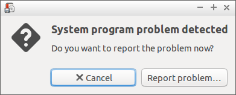

# How to Disable the System Program Problem Detected dialog box
Have you come across this pesky notice every time you boot up your Ubuntu machine?


## How to solve it?
1. Open your terminal and type
```sh
sudo nano /etc/default/apport
```

2. inside the file change `enabled=1` to `enabled=0` so the file should now look like this:
```
# set this to 0 to disable apport, or to 1 to enable it
# you can temporarily override this with
# sudo service apport start force_start=1
enabled=0
```

3. Hit `ctrl + x` and then `Y` to confirm your changes.

4. Restart computer
